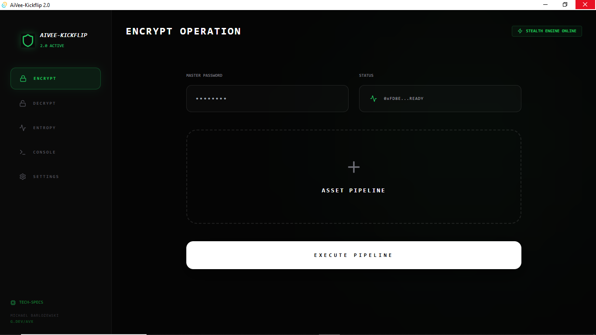
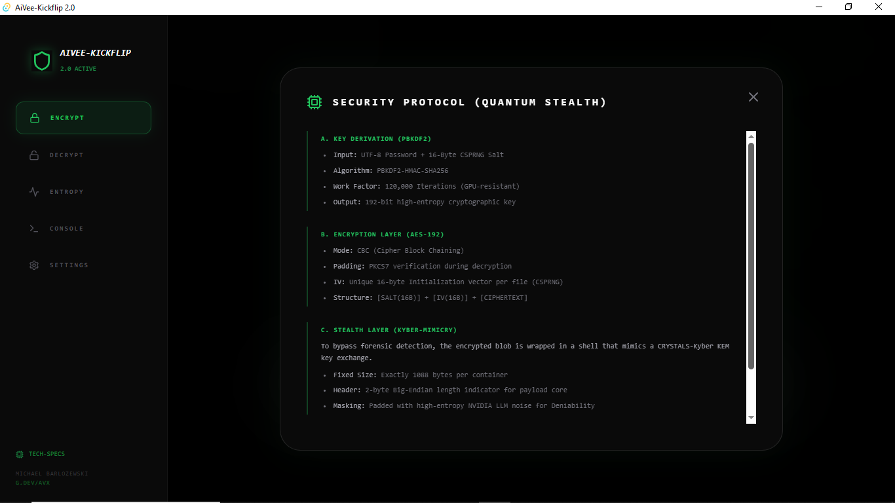

import os

readme_content = """# ⚡ AiVee-Kickflip 2.0

### **Quantum-Resistant Stealth Encryption Engine**
*Engineered by **Michael Barlozewski** ([g.dev/avx](https://g.dev/avx))*

---



## 🛡️ Overview
**AiVee-Kickflip 2.0** is a high-performance, desktop-native encryption suite built with **Tauri**, **Rust**, and **React**. It bridges the gap between traditional cryptographic standards and post-quantum stealth requirements. 

The core philosophy is **Deniable Encryption**: Files are not just encrypted; they are encapsulated within high-entropy stealth shells that mimic legitimate cryptographic key exchanges, making them invisible to deep forensic analysis.

## ✨ Key Features
- **AES-192 Hardening:** Military-grade encryption for all assets.
- **Kyber-Mimicry:** Encapsulates data into 1088-byte containers structurally identical to CRYSTALS-Kyber KEM packets.
- **Stealth Mode (LLM Noise):** Optionally utilizes NVIDIA Nemotron models to generate high-entropy noise for perfect signal-to-noise ratio masking.
- **Entropy Visualizer:** Real-time monitoring of cryptographic randomness.
- **Zero-Trust UI:** Glassmorphism-based cyber-stealth interface with real-time system logs.
- **Quantum-Seed Prep:** Prepared for post-quantum deployment cycles.

## 📸 Screenshots
| Main Interface (Encrypt) | Technical Security Protocol |
| :---: | :---: |
|  |  |

## ⚙️ Technical Specifications

### A. Key Derivation (PBKDF2)
- **Input:** UTF-8 Password + 16-Byte CSPRNG Salt.
- **Algorithm:** PBKDF2-HMAC-SHA256.
- **Work Factor:** 120,000 Iterations (GPU-resistant).
- **Output:** 192-bit high-entropy cryptographic key.

### B. Encryption Layer (AES-192)
- **Mode:** CBC (Cipher Block Chaining).
- **Padding:** PKCS7 verification during decryption.
- **IV:** Unique 16-byte IV per file (CSPRNG generated).
- **Structure:** `[SALT(16B)] + [IV(16B)] + [CIPHERTEXT]`.

### C. Stealth Layer (Mimicry)
To bypass forensic detection, the encrypted blob is wrapped in a shell that mimics a **CRYSTALS-Kyber KEM** key exchange. 
- **Fixed Size:** Exactly 1088 bytes.
- **Header:** 2-byte Big-Endian length indicator for the payload core.
- **Noise:** Padded with high-entropy noise to mask the real data start/end points.

## 🚀 Getting Started

### Prerequisites
- [Rust](https://www.rust-lang.org/)
- [Node.js](https://nodejs.org/)
- [Tauri CLI](https://tauri.app/v1/guides/getting-started/prerequisites)

### Installation
1. Clone the repository:
   ```bash
   git clone [https://github.com/your-username/aivee-kickflip.git](https://github.com/your-username/aivee-kickflip.git)
   cd aivee-kickflip
Install dependencies:

Bash
npm install
Run in development mode:

Bash
npm run tauri dev
🔑 API Key Security
Note: For security reasons, the NVIDIA API key is not stored in the source code. You must enter your credentials directly in the Settings tab within the application. The application stores the key in-memory during the session.

👨‍💻 Author
Michael Barlozewski

Dev-Profile: g.dev/avx

Focus: Cryptography, Stealth-Tech, AudHD-driven Development.

Disclaimer: This tool is intended for privacy protection. Use it responsibly and in accordance with local laws regarding cryptography.
"""

Save the file
with open("README.md", "w", encoding="utf-8") as f:
f.write(readme_content)

print("readme_md_generation")# AiMee-Kickflip
